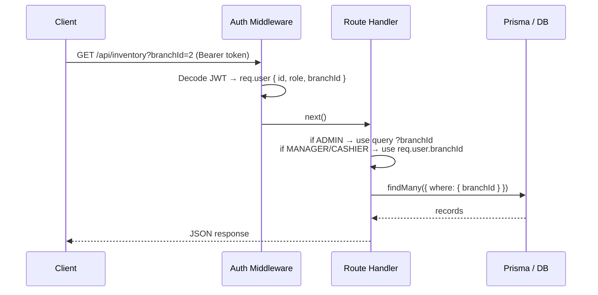
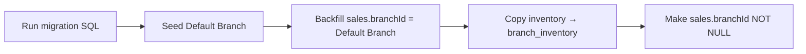
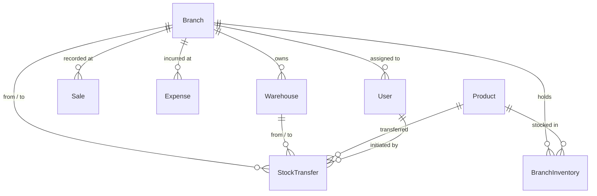

 n# Design Document: Branch & Warehouse Management

## Overview

This feature extends the POS system from a single-location model to a multi-branch architecture. The core change is that inventory, sales, and expenses become scoped to a `Branch`. A `Warehouse` model represents physical storage that may be linked to a branch or operate independently. Stock can be transferred between branches and warehouses via `StockTransfer`. Admins retain a global view with a branch selector; managers and cashiers are automatically scoped to their assigned branch.

The design follows the existing patterns in the codebase: Express route files, Prisma ORM, JWT auth middleware, and React component pages in the dashboard.

---

## Architecture

### High-Level Data Flow

```mermaid
graph TD
    subgraph Frontend
        BC[BranchContext] --> OV[Overview]
        BC --> INV[Inventory]
        BC --> SH[SalesHistory]
        BC --> EX[Expenses]
        BC --> RP[Reports]
        NS[Navbar Branch Selector] --> BC
    end

    subgraph Backend
        BA[/api/branches] --> DB
        WA[/api/warehouses] --> DB
        TA[/api/transfers] --> DB
        SA[/api/sales] --> DB
        IA[/api/inventory] --> DB
        RA[/api/reports] --> DB
    end

    Frontend -->|JWT + ?branchId=| Backend
    DB[(PostgreSQL / Neon)]
```

### Request Scoping Flow



### Migration Flow



---

## Components and Interfaces

### Backend Route Files (new)

| File | Mount Point | Auth |
|------|-------------|------|
| `src/routes/branches.js` | `/api/branches` | ADMIN only |
| `src/routes/warehouses.js` | `/api/warehouses` | ADMIN only |
| `src/routes/transfers.js` | `/api/transfers` | ADMIN, MANAGER |

### Backend Route Files (modified)

| File | Change |
|------|--------|
| `src/routes/inventory.js` | Switch from `Inventory` to `BranchInventory`; scope by `branchId` |
| `src/routes/sales.js` | Attach `req.user.branchId` on POST; filter by `branchId` on GET |
| `src/routes/reports.js` | Accept `?branchId=` on all endpoints; pass to all queries |
| `src/routes/users.js` | Accept `branchId` on create/update |
| `src/routes/expenses.js` | Attach `branchId` on create; filter on GET |
| `src/server.js` | Register new route files |

### Frontend Components (new)

| File | Purpose |
|------|---------|
| `src/context/BranchContext.jsx` | Stores `selectedBranchId` for admin; exposes hook |
| `src/components/dashboard/Branches.jsx` | CRUD table for branches |
| `src/components/dashboard/Warehouses.jsx` | CRUD table for warehouses |
| `src/components/dashboard/CreateTransfer.jsx` | Form to create a stock transfer |

### Frontend Components (modified)

| File | Change |
|------|--------|
| `src/components/Navbar.jsx` | Add `BranchSelector` dropdown for ADMIN |
| `src/pages/Dashboard.jsx` | Add sidebar items; wrap in `BranchProvider`; pass `branchId` to sections |
| `src/components/dashboard/Overview.jsx` | Read `selectedBranchId` from context; append `?branchId=` |
| `src/components/dashboard/Inventory.jsx` | Use `BranchInventory` API; show branch column for admin |
| `src/components/dashboard/SalesHistory.jsx` | Append `?branchId=` filter |
| `src/components/dashboard/AllExpenses.jsx` | Append `?branchId=` filter; show branch column |
| `src/components/dashboard/Reports.jsx` | Add branch filter dropdown for ADMIN |
| `src/components/dashboard/Users.jsx` | Add branch assignment dropdown |
| `src/components/cashier/Register.jsx` | Check `user.branchId`; use `BranchInventory` for stock check |

### Key Function Signatures

```js
// BranchContext
const { selectedBranchId, setSelectedBranchId } = useBranch()

// branches route
router.get('/',    authenticate, authorize('ADMIN'), listBranches)
router.post('/',   authenticate, authorize('ADMIN'), createBranch)
router.put('/:id', authenticate, authorize('ADMIN'), updateBranch)
router.delete('/:id', authenticate, authorize('ADMIN'), deactivateBranch)

// warehouses route
router.get('/',    authenticate, authorize('ADMIN'), listWarehouses)
router.post('/',   authenticate, authorize('ADMIN'), createWarehouse)
router.put('/:id', authenticate, authorize('ADMIN'), updateWarehouse)

// transfers route
router.post('/', authenticate, authorize('ADMIN', 'MANAGER'), createTransfer)
router.get('/',  authenticate, authorize('ADMIN', 'MANAGER'), listTransfers)

// inventory route (updated)
// GET /api/inventory?branchId=  — ADMIN sees all or filtered; MANAGER/CASHIER auto-scoped
router.get('/', authenticate, getInventory)
router.put('/:productId/adjust', authenticate, authorize('ADMIN', 'MANAGER'), adjustStock)
```

### API Contracts

**POST /api/branches**
```json
// Request
{ "name": "Downtown", "location": "123 Main St", "phone": "555-0100" }

// Response 201
{ "id": 1, "name": "Downtown", "location": "123 Main St", "phone": "555-0100", "isActive": true, "createdAt": "..." }

// Error 400
{ "error": "Branch name is required" }
```

**POST /api/warehouses**
```json
// Request
{ "name": "Central Warehouse", "location": "Industrial Zone", "branchId": 1 }

// Response 201
{ "id": 1, "name": "Central Warehouse", "location": "Industrial Zone", "branchId": 1, "isActive": true, "createdAt": "..." }

// Error 404
{ "error": "Branch not found" }
```

**POST /api/transfers**
```json
// Request
{
  "productId": 5,
  "quantity": 20,
  "fromBranchId": 1,
  "toBranchId": 2,
  "note": "Rebalancing stock"
}

// Response 201
{
  "id": 10,
  "productId": 5,
  "quantity": 20,
  "fromBranchId": 1,
  "toBranchId": 2,
  "transferredById": 3,
  "note": "Rebalancing stock",
  "createdAt": "..."
}

// Error 400 — insufficient stock
{ "error": "Insufficient stock at source location" }

// Error 404 — product not in source inventory
{ "error": "Product not found in source inventory" }
```

**GET /api/reports/overview-stats?branchId=1**
```json
{
  "totalSales": 4200.00,
  "totalExpenses": 800.00,
  "totalTransactions": 42,
  "lowStockCount": 3,
  "lowStockItems": [...],
  "weeklyChart": [...],
  "topProducts": [...],
  "paymentBreakdown": [...]
}
```

---

## Data Models

The full Prisma schema additions are specified in the requirements. Key relationships:



### JWT Token Payload (updated)

The auth login route must include `branchId` in the JWT payload so middleware can scope requests without an extra DB lookup:

```js
// backend/src/routes/auth.js — login handler
const token = jwt.sign(
  { id: user.id, role: user.role, branchId: user.branchId ?? null },
  process.env.JWT_SECRET,
  { expiresIn: '7d' }
)
```

The `user` object stored in `localStorage` must also include `branchId` so the frontend can read it from `useAuth()`.

### Branch Scoping Logic (backend)

A shared helper used across route files:

```js
// src/utils/branchScope.js
function resolveBranchId(req) {
  if (req.user.role === 'ADMIN') {
    return req.query.branchId ? parseInt(req.query.branchId) : undefined
  }
  return req.user.branchId ?? undefined
}
```

- `undefined` → no filter (admin all-branches view)
- `number` → filter to that branch

---

## Correctness Properties

*A property is a characteristic or behavior that should hold true across all valid executions of a system — essentially, a formal statement about what the system should do. Properties serve as the bridge between human-readable specifications and machine-verifiable correctness guarantees.*

### Property 1: Transfer atomicity — inventory conservation

*For any* valid stock transfer between two branches with sufficient source stock, the sum of `(source quantity + destination quantity)` for the transferred product SHALL be identical before and after the transfer.

**Validates: Requirements 8.2, 8.5**

### Property 2: Transfer rejection on insufficient stock

*For any* transfer request where the requested quantity exceeds the source `BranchInventory` quantity, the Transfer_API SHALL return a 400 error AND both the source and destination inventory quantities SHALL remain unchanged.

**Validates: Requirements 8.5**

### Property 3: Branch scoping invariant for non-admin users

*For any* Manager or Cashier user with an assigned `branchId`, every inventory record, sale record, and expense record returned by the API SHALL have a `branchId` equal to the user's assigned `branchId`.

**Validates: Requirements 5.1, 6.4, 7.3**

### Property 4: Admin branch filter correctness

*For any* Admin request with a `?branchId=N` query parameter, every record in the response SHALL have `branchId === N`, and no record from a different branch SHALL appear.

**Validates: Requirements 6.3, 9.3, 9.5, 11.4**

### Property 5: Sale stock decrement round-trip

*For any* completed sale at a branch, the `BranchInventory` quantity for each sold product at that branch SHALL decrease by exactly the sold quantity.

**Validates: Requirements 5.4**

### Property 6: Branch creation response completeness

*For any* valid branch creation request, the response SHALL contain all required fields: `id`, `name`, `location`, `phone`, `isActive`, and `createdAt`, with `isActive` defaulting to `true`.

**Validates: Requirements 1.2**

### Property 7: Warehouse branch reference validity

*For any* warehouse creation request that includes a `branchId`, the persisted warehouse SHALL reference an existing branch, and requests referencing a non-existent branch SHALL be rejected with a 404.

**Validates: Requirements 2.3, 2.5**

---

## Error Handling

| Scenario | HTTP Status | Response |
|----------|-------------|----------|
| Missing required field (e.g. branch `name`) | 400 | `{ "error": "Branch name is required" }` |
| Non-existent `branchId` on warehouse create | 404 | `{ "error": "Branch not found" }` |
| Transfer: product not in source inventory | 404 | `{ "error": "Product not found in source inventory" }` |
| Transfer: insufficient stock | 400 | `{ "error": "Insufficient stock at source location" }` |
| Non-admin accessing `/api/branches` | 403 | `{ "error": "You do not have permission to do this" }` |
| Cashier with no `branchId` attempting a sale | 400 | `{ "error": "User is not assigned to a branch" }` |
| DB transaction failure during transfer | 500 | `{ "error": "Transfer failed" }` |

All transfer inventory mutations run inside a `prisma.$transaction()` with a 15s timeout (matching the existing sales pattern) to handle Neon cloud latency. If the transaction throws, neither the source decrement nor the destination increment is committed.

---

## Testing Strategy

### Unit Tests

- `resolveBranchId(req)` helper: verify ADMIN with `?branchId=` returns parsed int, ADMIN without returns `undefined`, MANAGER returns `req.user.branchId`
- Branch creation validation: missing `name` returns 400
- Warehouse creation: non-existent `branchId` returns 404
- Transfer validation: quantity ≤ 0 returns 400; missing `productId` returns 400

### Property-Based Tests

Use **fast-check** (already compatible with the Node.js/Jest stack).

Each property test runs a minimum of **100 iterations**.

Tag format: `// Feature: branch-warehouse-management, Property N: <text>`

**Property 1 — Transfer atomicity**
Generate: two branch inventory records with random quantities (source ≥ transfer qty). Execute transfer. Assert `sourceBefore + destBefore === sourceAfter + destAfter`.

**Property 2 — Transfer rejection on insufficient stock**
Generate: source inventory with quantity Q, transfer request with quantity > Q. Assert 400 response and both inventory records unchanged.

**Property 3 — Branch scoping invariant**
Generate: random set of records across N branches, random non-admin user assigned to branch B. Assert all returned records have `branchId === B`.

**Property 4 — Admin branch filter correctness**
Generate: records across multiple branches, admin request with `?branchId=B`. Assert all returned records have `branchId === B`.

**Property 5 — Sale stock decrement**
Generate: branch inventory with quantity Q ≥ sale quantity S. Process sale. Assert new quantity === Q - S.

**Property 6 — Branch creation response completeness**
Generate: random valid branch payloads (name, location, optional phone). Assert response contains all required fields with correct types.

**Property 7 — Warehouse branch reference validity**
Generate: warehouse creation requests with random `branchId` values, some existing and some not. Assert existing → 201 with correct `branchId`; non-existing → 404.

### Integration Tests

- Full migration: run migration against a test DB, verify all existing `Sale`, `SaleItem`, `Payment`, `Expense`, `Customer` rows are preserved
- Default Branch seed: verify `branch_inventory` rows exist for all former `inventory` rows after migration
- End-to-end transfer: POST transfer → verify DB state of both `BranchInventory` rows and `StockTransfer` record

### Frontend Tests

- `BranchContext`: verify `selectedBranchId` propagates to API call query params
- `BranchSelector`: renders "All Branches" + one option per active branch; selecting an option updates context
- `Branches` page: renders table with correct columns; create form calls `POST /api/branches`
- `Warehouses` page: renders table; branch dropdown populated from `/api/branches`
